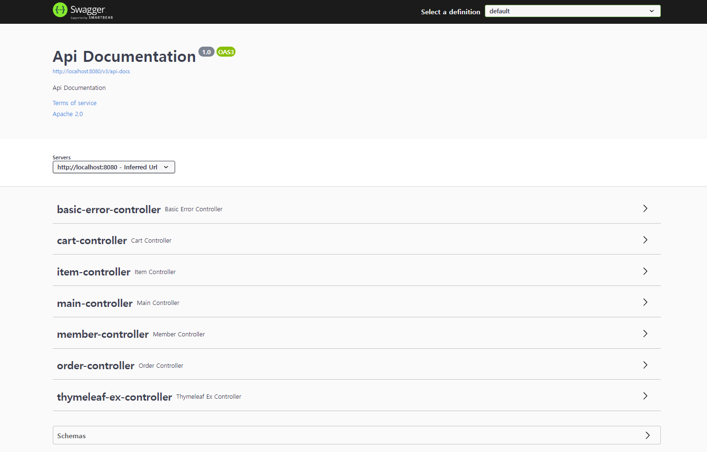

<h1>쇼핑몰 프로젝트</h1>

1. springboot version
  : 2.7.1
```xml
<parent>
  <groupId>org.springframework.boot</groupId>
  <artifactId>spring-boot-starter-parent</artifactId>
  <version>2.7.1</version>
  <relativePath/> <!-- lookup parent from repository -->
</parent>
```

2. java version
  : 11
```xml
<properties>
  <java.version>11</java.version>
</properties>
```

3.
이 프로젝트는 MySQL 데이터베이스를 사용합니다. MySQL 데이터베이스와의 연결을 위해 `mysql-connector-java` 라이브러리가 필요합니다. Maven을 사용하는 경우, `pom.xml` 파일에 다음 의존성을 추가하십시오:

```xml
<dependency>
    <groupId>mysql</groupId>
    <artifactId>mysql-connector-java</artifactId>
    <scope>runtime</scope>
</dependency>
```
4. 주요 버전별 구현 방법<br>
● 스프링 부트 2.X.X ~ 2.6.X (스프링 5.X.X ~ 5.6.X)
```java
public class WebSecurityConfig extends WebSecurityConfigurerAdapter {

    @Override
    protected void configure(HttpSecurity http) throws Exception {
     http
	.authorizeRequests()
        .antMatchers("/").authenticated()
        .anyRequest().permitAll();
    }
}
```
  &nbsp;&nbsp;&nbsp;&nbsp;● 스프링 부트 2.7.X ~ 3.0.X (스프링 5.7.X M2 ~ 6.0.X)
```java
public class SpringSecurityConfig {

    @Bean
    public SecurityFilterChain filterChain(HttpSecurity http) throws Exception {
        http
	 .authorizeHttpRequests()
	 .requestMatchers("/admin").hasRole("ADMIN")
	 .anyRequest().authenticated();
        return http.build();
    }
}
```
   &nbsp;&nbsp;&nbsp;&nbsp;● 스프링 부트 3.1.X ~ (스프링 6.1.X ~ )
```java
public class SpringSecurityConfig {

    @Bean
    public SecurityFilterChain filterChain(HttpSecurity http) throws Exception {
        http
            .authorizeHttpRequests((auth) -> auth
                  .requestMatchers("/login", "/join").permitAll()
                  .anyRequest().authenticated()
        );
        return http.build();
    }
}
```
5. SecurityConfig.java : 설정 파일 변경
```java
package com.shop.config;

import lombok.extern.log4j.Log4j2;
import org.springframework.context.annotation.Bean;
import org.springframework.context.annotation.Configuration;
import org.springframework.security.config.annotation.web.builders.HttpSecurity;
import org.springframework.security.config.annotation.web.configuration.EnableWebSecurity;
import org.springframework.security.crypto.bcrypt.BCryptPasswordEncoder;
import org.springframework.security.crypto.password.PasswordEncoder;
import org.springframework.security.web.SecurityFilterChain;

@Configuration
@EnableWebSecurity
@Log4j2
public class SecurityConfig {

    @Bean
    public SecurityFilterChain securityFilterChain(HttpSecurity http) throws Exception{

        log.info("--------------------securityFilterChain-----------------------------");
        http.csrf().disable();

        return http.build();
    }

    @Bean
    public PasswordEncoder passwordEncoder(){
        return new BCryptPasswordEncoder();
    }
}

```
6. SecurityConfig.java : 최종변경
```java
package com.shop.config;

import com.shop.service.MemberService;
import lombok.extern.log4j.Log4j2;
import org.springframework.beans.factory.annotation.Autowired;
import org.springframework.context.annotation.Bean;
import org.springframework.context.annotation.Configuration;
import org.springframework.security.config.annotation.web.builders.HttpSecurity;
import org.springframework.security.config.annotation.web.configuration.EnableWebSecurity;
import org.springframework.security.crypto.bcrypt.BCryptPasswordEncoder;
import org.springframework.security.crypto.password.PasswordEncoder;
import org.springframework.security.web.SecurityFilterChain;
import org.springframework.security.web.util.matcher.AndRequestMatcher;
import org.springframework.security.web.util.matcher.AntPathRequestMatcher;

@Configuration
@EnableWebSecurity
@Log4j2
public class SecurityConfig {

    @Autowired
    MemberService memberService;
    @Bean
    public SecurityFilterChain securityFilterChain(HttpSecurity http) throws Exception{

        log.info("--------------------securityFilterChain-----------------------------");

        http.formLogin()
            .loginPage("/members/login")
            .defaultSuccessUrl("/")
//                login폼에서 name을 username 대신 사용할 때 변경된 이름을 기입한다.
            .usernameParameter("email")
            .failureUrl("/members/login/error")
            .and()
            .logout()
            .logoutRequestMatcher(new AntPathRequestMatcher("/members/logout"))
            .logoutSuccessUrl("/");

        http.authorizeRequests()
                .mvcMatchers("/css/**", "/js/**", "/img/**").permitAll()
                .mvcMatchers("/", "/members/**", "/item/**", "/images/**").permitAll()
                .mvcMatchers("/admin/**").hasRole("ADMIN")
                .anyRequest().authenticated()
        ;

        http.exceptionHandling()
                .authenticationEntryPoint(new CustomAuthenticationEntryPoint())
        ;

        http.csrf().disable();

        return http.build();
    }

    @Bean
    public PasswordEncoder passwordEncoder(){
        return new BCryptPasswordEncoder();
    }
}

```

7. pom.xml 설정파일
```xml
<?xml version="1.0" encoding="UTF-8"?>
<project xmlns="http://maven.apache.org/POM/4.0.0" xmlns:xsi="http://www.w3.org/2001/XMLSchema-instance"
         xsi:schemaLocation="http://maven.apache.org/POM/4.0.0 https://maven.apache.org/xsd/maven-4.0.0.xsd">
    <modelVersion>4.0.0</modelVersion>
    <parent>
        <groupId>org.springframework.boot</groupId>
        <artifactId>spring-boot-starter-parent</artifactId>
        <version>2.7.1</version>
        <relativePath/> <!-- lookup parent from repository -->
    </parent>
    <groupId>com.shop</groupId>
    <artifactId>shop</artifactId>
    <version>0.0.1-SNAPSHOT</version>
    <name>shop</name>
    <description>shop</description>
    <properties>
        <java.version>11</java.version>
    </properties>
    <dependencies>

        <dependency>
            <groupId>org.springframework.boot</groupId>
            <artifactId>spring-boot-starter-data-jpa</artifactId>
        </dependency>

        <dependency>
            <groupId>org.springframework.boot</groupId>
            <artifactId>spring-boot-starter-thymeleaf</artifactId>
        </dependency>
        <dependency>
            <groupId>org.springframework.boot</groupId>
            <artifactId>spring-boot-starter-web</artifactId>
        </dependency>

        <dependency>
            <groupId>org.springframework.boot</groupId>
            <artifactId>spring-boot-devtools</artifactId>
            <scope>runtime</scope>
            <optional>true</optional>
        </dependency>

        <dependency>
            <groupId>mysql</groupId>
            <artifactId>mysql-connector-java</artifactId>
            <scope>runtime</scope>
        </dependency>

        <dependency>
            <groupId>org.projectlombok</groupId>
            <artifactId>lombok</artifactId>
            <optional>true</optional>
        </dependency>

        <dependency>
            <groupId>org.springframework.boot</groupId>
            <artifactId>spring-boot-starter-test</artifactId>
            <scope>test</scope>
        </dependency>


        <dependency>
            <groupId>com.querydsl</groupId>
            <artifactId>querydsl-jpa</artifactId>
        </dependency>

        <dependency>
            <groupId>com.querydsl</groupId>
            <artifactId>querydsl-apt</artifactId>
        </dependency>

        <dependency>
            <groupId>com.querydsl</groupId>
            <artifactId>querydsl-core</artifactId>
        </dependency>

        <!-- https://mvnrepository.com/artifact/nz.net.ultraq.thymeleaf/thymeleaf-layout-dialect -->
        <dependency>
            <groupId>nz.net.ultraq.thymeleaf</groupId>
            <artifactId>thymeleaf-layout-dialect</artifactId>
            <version>3.0.0</version>
        </dependency>

        <dependency>
            <groupId>org.springframework.boot</groupId>
            <artifactId>spring-boot-starter-security</artifactId>
        </dependency>

        <dependency>
            <groupId>org.springframework.boot</groupId>
            <artifactId>spring-boot-starter-validation</artifactId>
        </dependency>

        <dependency>
            <groupId>org.springframework.security</groupId>
            <artifactId>spring-security-test</artifactId>
            <scope>test</scope>
        </dependency>

        <!-- https://mvnrepository.com/artifact/org.thymeleaf.extras/thymeleaf-extras-springsecurity5 -->
        <dependency>
            <groupId>org.thymeleaf.extras</groupId>
            <artifactId>thymeleaf-extras-springsecurity5</artifactId>
        </dependency>

        <dependency>
            <groupId>org.modelmapper</groupId>
            <artifactId>modelmapper</artifactId>
            <version>3.1.0</version>
        </dependency>

    </dependencies>

    <build>
        <plugins>
            <plugin>
                <groupId>org.springframework.boot</groupId>
                <artifactId>spring-boot-maven-plugin</artifactId>
                <configuration>
                    <excludes>
                        <exclude>
                            <groupId>org.projectlombok</groupId>
                            <artifactId>lombok</artifactId>
                        </exclude>
                    </excludes>
                </configuration>
            </plugin>

            <plugin>
                <groupId>com.mysema.maven</groupId>
                <artifactId>apt-maven-plugin</artifactId>
                <version>1.1.3</version>
                <executions>
                    <execution>
                        <goals>
                            <goal>process</goal>
                        </goals>
                        <configuration>
                            <outputDirectory>target/generated-sources/java</outputDirectory>
                            <processor>com.querydsl.apt.jpa.JPAAnnotationProcessor</processor>
                        </configuration>
                    </execution>
                </executions>
            </plugin>

        </plugins>
    </build>

</project>

```
<br>
8. Swagger Api

<h6>swagger 설정 이미지</h6><br>


```xml
<!-- https://mvnrepository.com/artifact/io.springfox/springfox-boot-starter -->
<dependency>
    <groupId>io.springfox</groupId>
    <artifactId>springfox-boot-starter</artifactId>
    <version>3.0.0</version>
</dependency>
<br>
```
<h6>application.properties</h6>

```java
spring.mvc.pathmatch.matching-strategy=ant_path_matcher
```
<br>

<h6>com.shop.config -> SwaggerConfig 설정</h6>

```java
@Configuration
public class SwaggerConfig {
    private final String TITLE = "title";
    private final String DESCRIPTION = "description";
    private final String VERSION = "V1.0.0";

    @Bean
    public OpenAPI api() {
        return new OpenAPI()
                .info(new Info()
                        .title(TITLE)
                        .description(DESCRIPTION)
                        .version(VERSION)
                );
    }
}

```